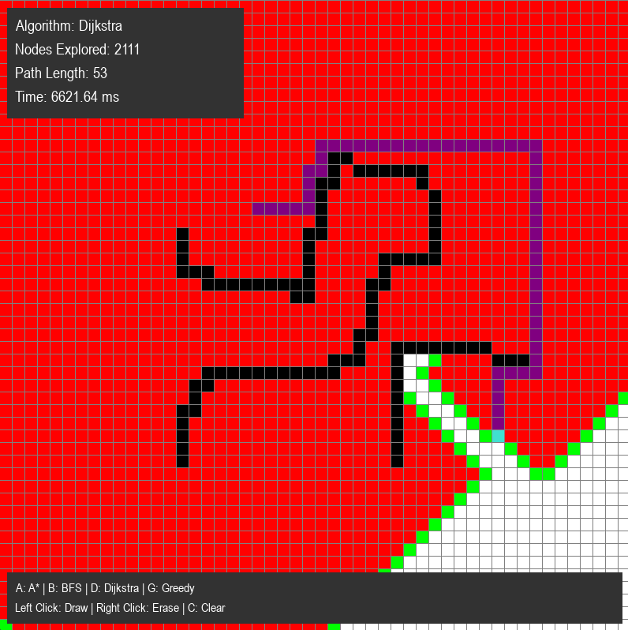

# Pathfinding Algorithm Visualizer

A visual comparison tool for pathfinding algorithms, built with Python and Pygame. This project visualizes 4 unique pathfinding algorithms and provides statistics on the performance of each.


*Example: Dijkstra's algorithm finding the shortest path*

## Algorithms Implemented

- **A\*** - Combines actual distance and heuristic estimation for optimal and efficient pathfinding
- **Dijkstra's Algorithm** - Guarantees shortest path by exploring nodes based on actual distance
- **Breadth-First Search (BFS)** - Simple layer-by-layer exploration, guarantees shortest path on unweighted grids
- **Greedy Best-First Search** - Fast but non-optimal, uses only heuristic to guide search

## Features

- **Interactive Grid** - Click to place start point, end point, and barriers
- **Real-time Visualization** - Watch algorithms explore the grid step-by-step
- **Performance Statistics** - Compare nodes explored, path length, and execution time
- **Multiple Algorithms** - Switch between algorithms instantly to compare approaches

## Installation

### Requirements
- Python 3.7+
- Pygame

### Setup
```bash
# Clone the repository
git clone https://github.com/dylanbyrne3454/Pathfinding_visualiser.git
cd Pathfinding_visualiser

# Install dependencies
pip install pygame
```

## Usage

### Running the Program
```bash
python main.py
```

### Controls

**Mouse:**
- **Left Click** - Place start point (orange), then end point (turquoise), then draw barriers (black)
- **Right Click** - Erase cells

**Keyboard:**
- **A** - Run A* algorithm
- **B** - Run BFS algorithm  
- **D** - Run Dijkstra's algorithm
- **G** - Run Greedy Best-First algorithm
- **C** - Clear grid and reset

## Future Enhancements

Potential additions:
- [ ] Automated benchmarking across random mazes
- [ ] Weighted grids (different terrain costs)
- [ ] Maze generation algorithms
- [ ] Export path and statistics to CSV